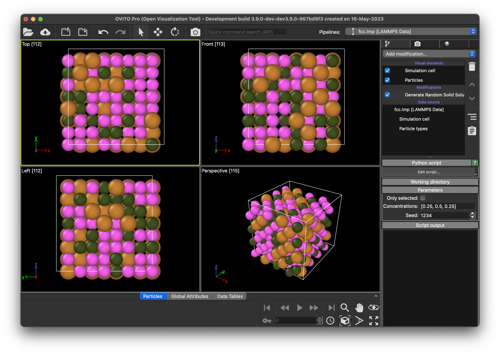
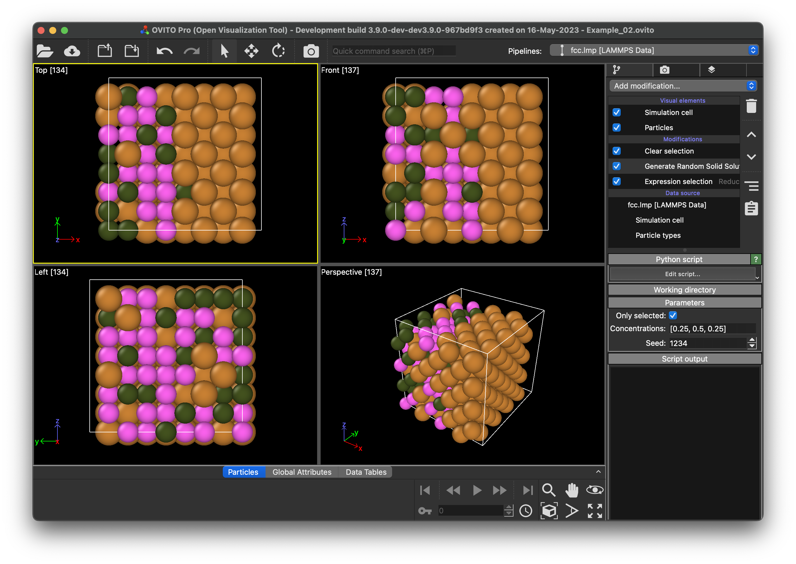

# Generate Random Solution
*OVITO* [Python modifier](https://docs.ovito.org/python/introduction/custom_modifiers.html) to change the particle type values to create a random solution of a given composition.

## Description
Python modifier for *OVITO* that changes the particle types in the whole data collection or a selected subset of particles to match a user-provided target concentration. The new particle types are distributed randomly to approximate a perfect random solution. The modifier can be installed either into *OVITO Pro* or the [*OVITO* Python module](https://pypi.org/project/ovito/) Python module using *pip*.

## Parameters 
- `only_selected` / "only selected": Apply the modifier only to the selected particles.
- `concentrations` / "Concentrations": List defining the target concentrations. Their sum has to be equal to 1. 
- `seed` / "Seed": Starting value for the random number generation. 

## Examples
- All examples rely on [fcc.lmp](Examples/fcc.lmp) as input structure. 

1. [Example 01](Examples/example_01.py) loads the [structure file](Examples/fcc.lmp) and changes its composition from purely type 1 to a random solid solution containing 3 types with concentrations of 0.25, 0.5, and 0.25, respectively.
1. [Example 02](Examples/example_02.py) loads the same [structure file](Examples/fcc.lmp), selects all atoms with a relative position < 0.5 and changes the composition of the selected atoms from type 1 to a random solid solution containing 3 types with concentrations of 0.25, 0.5, and 0.25, respectively. The overall sample composition will not match these concentrations as the unselected region will still be of type 1.

- The following two figures show the same two examples in the *OVITO PRO* GUI.



## Installation
- OVITO Pro [integrated Python interpreter](https://docs.ovito.org/python/introduction/installation.html#ovito-pro-integrated-interpreter):
  ```
  ovitos -m pip install --user git+https://github.com/nnn911/GenerateRandomSolution.git
  ``` 
  The `--user` option is recommended and [installs the package in the user's site directory](https://pip.pypa.io/en/stable/user_guide/#user-installs).

- Other Python interpreters or Conda environments:
  ```
  pip install git+https://github.com/nnn911/GenerateRandomSolution.git
  ```

## Technical information / dependencies
- Tested on *OVITO* 3.9.1

## Contact
- Daniel Utt (utt@ovito.org)
